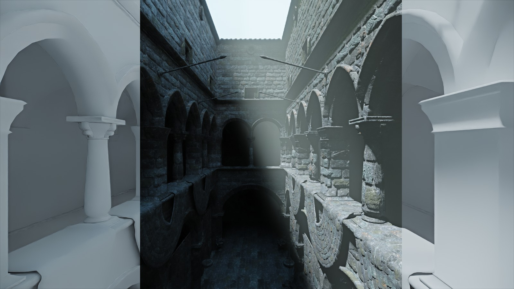
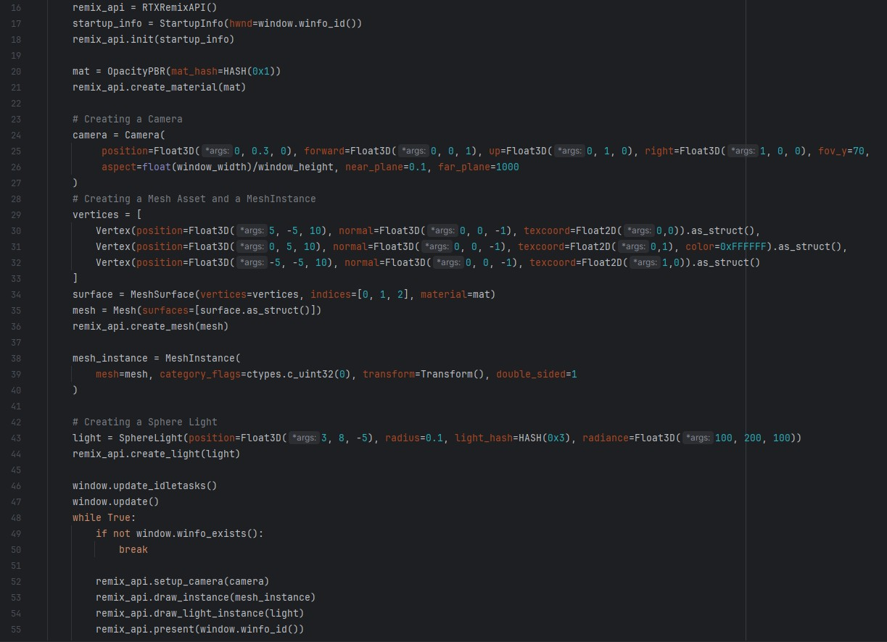

# PyRtxRemix
### A Python Wrapper over the Nvidia RTX Remix C API for its Raytracing Engine.



# Installation
### For users
```commandline
>>> pip install py-rtx-remix
>>> mkdir bin  # At your project root.
# Download the latest release or action builds of dxvk-remix and paste inside bin/.
```

### For developers
```commandline
>>> git clone git@github.com:Ekozmaster/py-rtx-remix.git
>>> cd py-rtx-remix
>>> mkdir bin
# Download the latest release or action builds of dxvk-remix and paste inside bin.
# https://github.com/NVIDIAGameWorks/dxvk-remix/actions
# Open x64 Native Tools Command Prompt for VS 20xx and run build_remixapi.bat
>>> mv remixapi.dll src/py_rtx_remix/
```

# Features
- Wraps around the RTX Remix C API via a remixapi.dll using ctypes.
- Provides a Pythonic and ergonomic interface to remix's components and function calls.
- Ships with a simple obj loader to assist with scene building and testing.
- Requires no other dependencies, except for development and testing.

# Usage
- You're supposed to manage your own window and provide a HWND. Python has tkinter built-in to help.
- Instantiate `RTXRemixAPI()` and call `init()` with your HWND.
```python
import tkinter as tk
from py_rtx_remix.core import RTXRemixAPI, StartupInfo

window_width = 1600
window_height = 900
window = tk.Tk()
window.title("PyRTXRemix")
window.geometry(f"{window_width}x{window_height}")

remix_api = RTXRemixAPI()
startup_info = StartupInfo(hwnd=window.winfo_id())
remix_api.init(startup_info)
```
- For more examples like creating a mesh, materials and lights check the `example.py` file.
